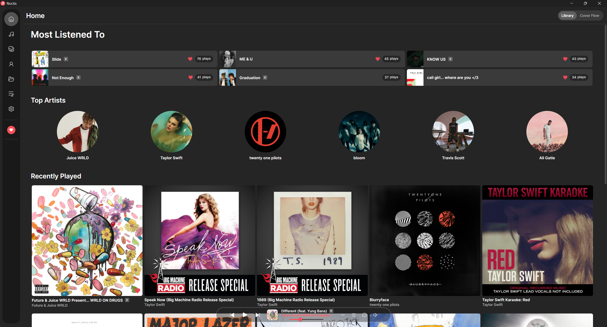
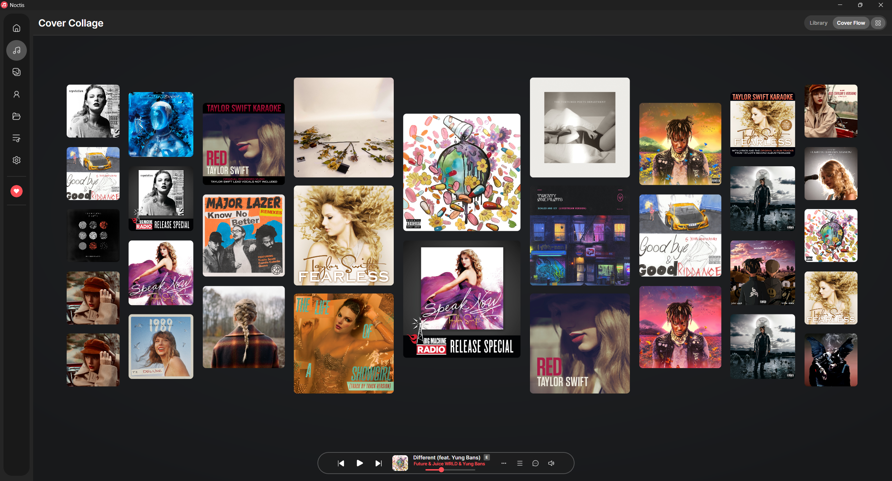
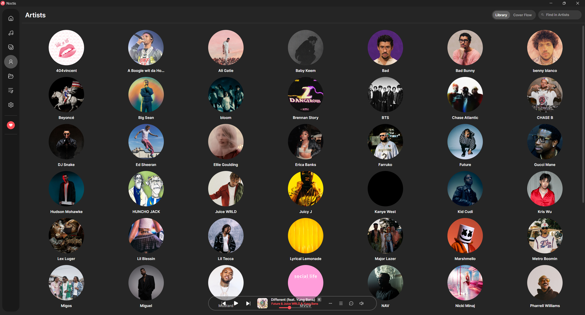
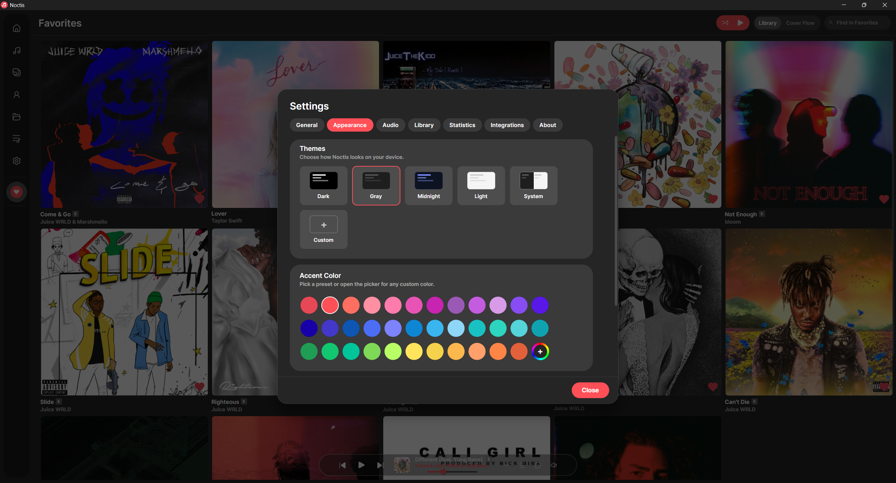

<div align="center">

<h1>
  &nbsp;Noctis
</h1>

A music player that respects what's yours. Zero tracking, total control.

[](https://discord.gg/BNCDZQUVx7) &nbsp; [](https://github.com/heartached/Noctis/releases)

[](LICENSE)
[]()
[]()
[](https://github.com/heartached/Noctis/actions)

</div>

---

## Screenshots











---

## Install

**Windows** — via a package manager:

```powershell
# winget
winget install heartached.Noctis

# Scoop (add the bucket once, then install)
scoop bucket add noctis https://github.com/heartached/scoop-bucket
scoop install noctis

# Chocolatey
choco install noctis
```

Or download the installer / portable zip from the
[latest release](https://github.com/heartached/Noctis/releases/latest).

**macOS / Linux** — download the `.dmg` / AppImage from the
[latest release](https://github.com/heartached/Noctis/releases/latest).

---

## Features

Everything below ships in the box — no accounts, no upsells, no telemetry.

- [x] Lossless formats — FLAC, ALAC, WAV, AIFF, APE, WavPack (plus MP3, AAC, OGG, Opus, WMA, M4A)
- [x] Gapless playback & crossfade
- [x] Parametric equalizer with presets
- [x] Bit-perfect WASAPI exclusive output with a live signal-path badge (Windows)
- [x] ReplayGain & loudness normalization
- [x] Audio converter — batch transcode to FLAC, MP3, AAC, and more (ffmpeg-backed)
- [x] Floating mini player
- [x] Songs, Albums, Artists, Folders & Playlists views
- [x] Release-type aware sections (Albums / Singles / EPs / Compilations) with filter chips
- [x] Smart playlists, favorites & drag-to-reorder playlists
- [x] Full metadata editor with artwork, lyrics & per-track options
- [x] Drag-and-drop import and multi-select bulk actions in every view
- [x] Duplicate finder & file organizer (rename/move by metadata)
- [x] Command palette for fast navigation
- [x] Library statistics plus a "Wrap" year / month listening recap
- [x] Synced lyrics via LRCLIB & NetEase with offline cache
- [x] Plain + synced lyrics editor with `.lrc` sidecar export
- [x] Side lyrics panel alongside any view
- [x] Share lyrics as image cards or short video clips
- [x] Cover Flow album browsing
- [x] Animated cover art for the now-playing track
- [x] Dynamic ambient backgrounds on lyrics & album pages
- [x] Custom themes & accent colors with a built-in theme editor
- [x] Navidrome, SMB & WebDAV remote sources with offline cache
- [x] Web remote — control playback from your phone's browser over your LAN
- [x] Artist images & bios via MusicBrainz and Deezer; artwork lookup via iTunes
- [x] Last.fm scrobbling + album descriptions
- [x] ListenBrainz scrobbling
- [x] Discord Rich Presence
- [x] In-app self-update from GitHub releases

---

## Build

```bash
git clone https://github.com/heartached/Noctis
cd Noctis
dotnet run --project src/Noctis/Noctis.csproj
```

**Requirements:** .NET 8 SDK

Supported platforms: Windows 10/11 (x64), macOS 12+ (Intel & Apple Silicon), Linux (x64 & ARM64).

### Native dependency — libvlc

- **Windows:** bundled automatically via NuGet — nothing to install.
- **macOS:** install [VLC](https://www.videolan.org/vlc/) (Noctis loads libvlc from `/Applications/VLC.app`):
  ```bash
  brew install --cask vlc
  ```
- **Linux:** install via your package manager. The `-dev` package provides the
  unversioned `libvlc.so` symlink that the .NET loader looks for:
  ```bash
  # Debian/Ubuntu
  sudo apt install libvlc-dev
  # Fedora
  sudo dnf install vlc-devel
  # Arch
  sudo pacman -S vlc
  ```

### Running a downloaded build (macOS / Linux)

The macOS and Linux artifacts on the [Releases page](https://github.com/heartached/Noctis/releases)
are unsigned self-contained builds. After unzipping:

**macOS:**
```bash
cd Noctis-macos-arm64
xattr -dr com.apple.quarantine .   # remove Gatekeeper quarantine flag
./Noctis
```

**Linux:**
```bash
cd Noctis-linux-x64
chmod +x Noctis
./Noctis
```

### Build for another OS

```bash
dotnet publish src/Noctis/Noctis.csproj -c Release -r linux-x64   --self-contained
dotnet publish src/Noctis/Noctis.csproj -c Release -r osx-arm64   --self-contained
dotnet publish src/Noctis/Noctis.csproj -c Release -r osx-x64     --self-contained
dotnet publish src/Noctis/Noctis.csproj -c Release -r linux-arm64 --self-contained
```

---

## Star History

<!-- Rendered by .github/workflows/star-history.yml (star-history.com embeds
     no longer work anonymously) and served from the star-history branch. -->
<a href="https://github.com/heartached/Noctis/stargazers">
  <picture>
    <source media="(prefers-color-scheme: dark)" srcset="https://raw.githubusercontent.com/heartached/Noctis/star-history/star-history-dark.svg">
    
  </picture>
</a>

---

## Feedback

If you have any feedback about bugs, feature requests, etc. about the app, please let me know through [issues](https://github.com/heartached/Noctis/issues).

Yours Truly, heartached.

---

## License

MIT — see [LICENSE](LICENSE)

---

> [!WARNING]
> Windows may flag the installer as untrusted because it isn't code-signed. This is normal for indie software — the app is safe to use.
