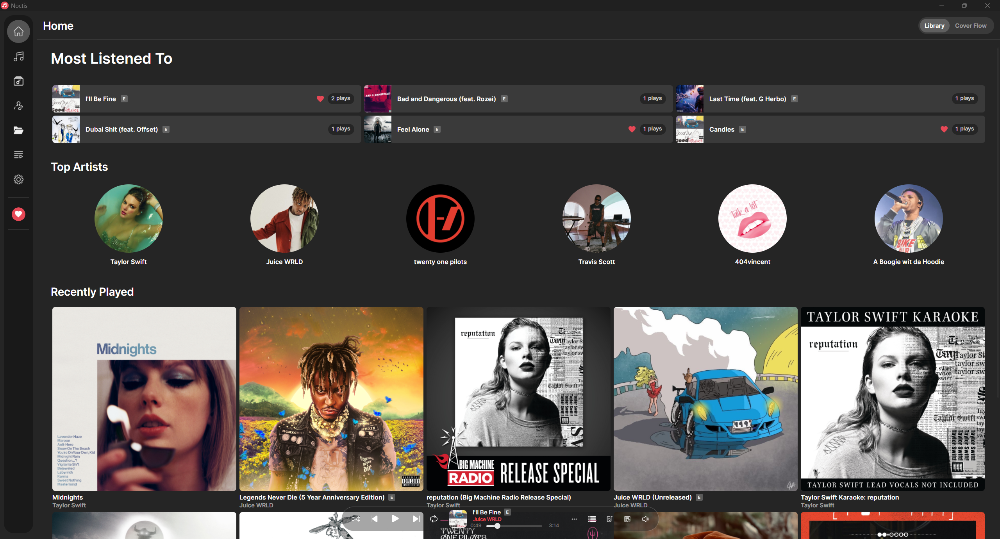
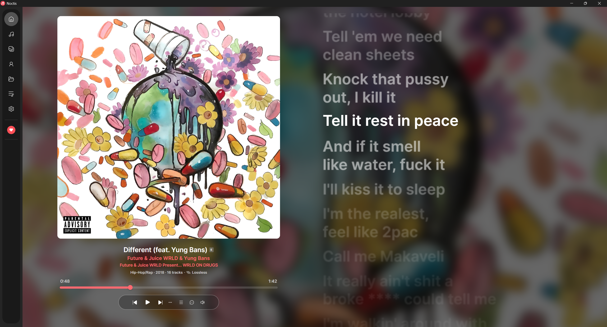
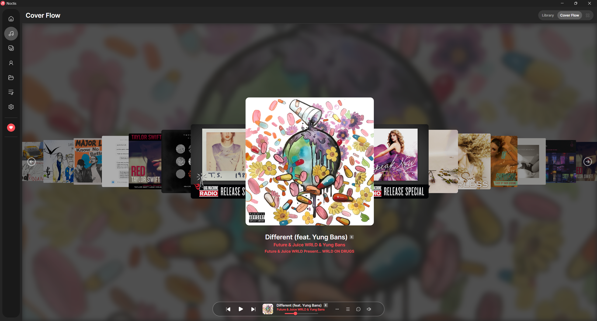
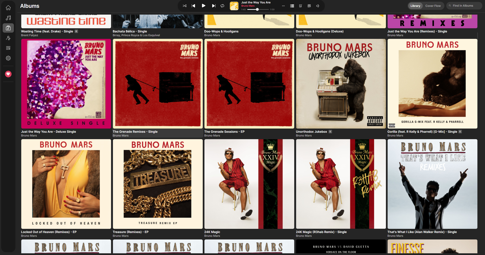
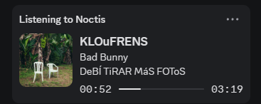

<div align="center">

<h1>
  &nbsp;Noctis
</h1>

A music player that respects what's yours. Zero tracking, total control.

[](LICENSE)
[]()
[]()
[](https://github.com/heartached/Noctis/releases)
[](https://github.com/heartached/Noctis/actions)

[Download](https://github.com/heartached/Noctis/releases) • [Features](#features) • [Build](#build) • [Feedback](#feedback)

</div>

---

### Home



### Synced Lyrics



### Cover Flow



### Albums



### Discord Rich Presence



---

## Features

It packs a horizon of features including,

- [x] Lossless audio support — FLAC, ALAC, WAV, AIFF, APE, WavPack (plus MP3, AAC, OGG, Opus, WMA, M4A)
- [x] Cover Flow view for browsing albums
- [x] Synced lyrics via LRCLIB with offline cache
- [x] Side lyrics panel alongside any view
- [x] Collapsible sidebar with smooth animation
- [x] 10-band equalizer with presets
- [x] Smart playlists & favorites
- [x] Drag and drop import from Windows Explorer
- [x] Multi-select with bulk actions across all library views
- [x] In-app self-update from GitHub releases
- [x] Dynamic ambient backgrounds on lyrics and album pages
- [x] Playlist management with artwork, drag reorder, and real-time counts
- [x] Replay Gain & volume normalization
- [x] Gapless playback & crossfade
- [x] Full metadata editor with artwork, lyrics, and per-track options
- [x] Library statistics with play counts, genre distribution, and listening trends
- [x] Navidrome, SMB, and WebDAV remote source support with offline cache
- [x] Last.fm scrobbling
- [x] Discord Rich Presence integration
- [x] Library indexing with SQLite

---

## Build

```bash
git clone https://github.com/heartached/noctis
dotnet run --project src/Noctis/Noctis.csproj
```

**Requirements:** .NET 8 SDK · Windows 10/11 x64

---

## Star History

[](https://star-history.com/#heartached/Noctis&Date)

---

## Feedback

If you have any feedback about bugs, feature requests, etc. about the app, please let me know through [issues](https://github.com/heartached/Noctis/issues).

Yours Truly, heartached.

---

## License

MIT — see [LICENSE](LICENSE)

---

> [!WARNING]
> Windows may flag the installer as untrusted because it isn't code-signed. This is normal for indie software — the app is safe to use.
