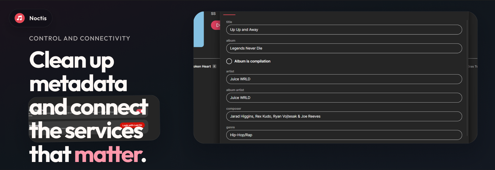
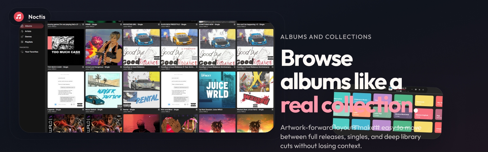
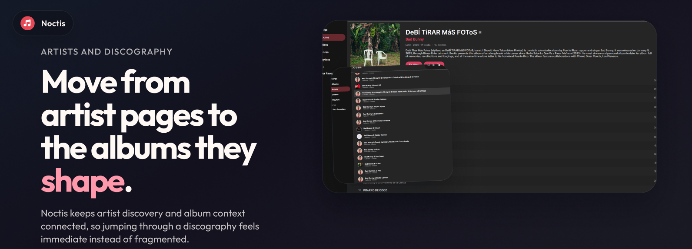
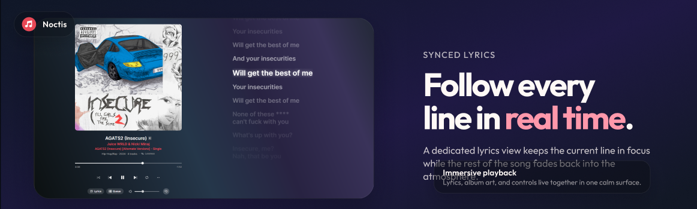
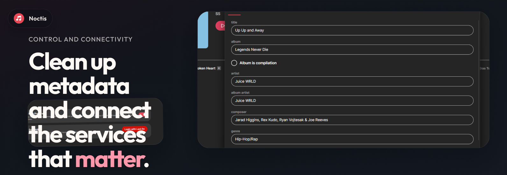

<div align="center">

# Noctis

A sleek Windows music player with synced lyrics, equalizer, smart playlists, and a beautiful dark UI.

[](LICENSE)
[](https://github.com/heartached/Noctis/releases)
[](https://github.com/heartached/Noctis/actions)

[Download](https://github.com/heartached/Noctis/releases) • [Features](#features) • [Build](#build)

</div>

---

> [!WARNING]
> Windows may flag the installer as untrusted because it isn't code-signed. This is normal for indie software — the app is safe to use.

---











---

## Features

- **Cover Flow view** — browse albums in a wide carousel with smooth navigation
- **Side lyrics panel** — view synced lyrics alongside any view without leaving it
- **Collapsible sidebar** — icon-only sidebar that expands on hover with smooth animation
- **Drag and drop import** — import files and folders directly from Windows Explorer
- **Multi-select with bulk actions** — Ctrl+Click and Ctrl+A across Albums, Songs, Playlists, Favorites with bulk remove, add to playlist, and favorites toggle
- **In-app self-update** — check for and install updates directly from Settings
- **Dynamic ambient backgrounds** — album color gradient backgrounds on lyrics and album detail pages
- **Playlist management with artwork** — drag reorder, 2x2 collage thumbnails, real-time count updates
- **Synced lyrics** via LRCLIB with offline cache
- **Advanced 10-band equalizer** with presets
- **Smart playlists & favorites**
- **Lossless audio support** — FLAC, ALAC, WAV, AIFF, and more
- **Replay Gain & volume normalization**
- **Gapless playback & crossfade**
- **Album art & full metadata display**
- **Last.fm scrobbling**
- **Discord Rich Presence** integration
- **Library indexing** with SQLite

---

## Build

```bash
git clone https://github.com/heartached/noctis
dotnet run --project src/Noctis/Noctis.csproj
```

**Requirements:** .NET 8 SDK · Windows 10/11 x64

---

## License

MIT — see [LICENSE](LICENSE)
